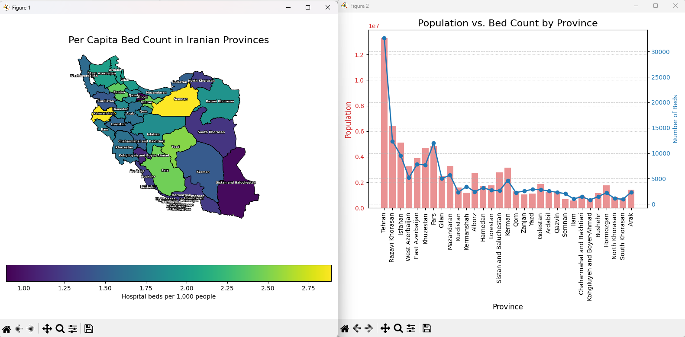

# Iran Healthcare Capacity Map 🏥🌍



Welcome to the **Iran Healthcare Capacity Map** project! This comprehensive geospatial analysis visualizes healthcare resources across Iranian provinces, specifically focusing on population data and hospital bed availability. The aim is to provide insights into healthcare infrastructure disparities and support data-driven decision-making.

---

## 🎯 Data Source & Updates
This project utilizes data from the **Statistical Center of Iran**, with the core data pertaining to the year 1395 (Iranian Solar Hijri calendar) / 2016.

We are passionate about keeping this project up-to-date and relevant. We warmly welcome contributions for improving the project and updating the datasets. Your input can help us create a more accurate and current representation of Iran's healthcare landscape.

---

## 🔍 Overview
This project maps the distribution of hospital beds in relation to population sizes across Iran’s provinces. Using shapefiles and pandas data analysis, it offers a clear visual understanding of where healthcare resources are concentrated and where gaps may exist.

---

## 🎯 Objectives & Results
- **Analyze** the healthcare capacity in each province by comparing population with hospital beds.
- **Visualize** provincial borders with color-coded metrics related to healthcare resources.
- **Support policymakers** and healthcare organizations in identifying underserved areas.
- **Provide a foundation** for further detailed spatial and statistical analyses.

---

## 🛠️ Features
- Data integration of population and healthcare infrastructure.
- Geospatial visualization using GeoPandas and Matplotlib.
- Customizable for different dataset inputs.
- Clear, interactive-style maps for easy interpretation.

---
## 🖌️ We utilized various visualization techniques:
- **Bar charts** 📊 to represent population distribution across provinces.
- **Line charts** 📈 for trends or specific linear data (if applicable).
- **Heatmaps** 🌡️ to visualize the ratio of hospital beds to population, highlighting disparities.

---
## 🚀 How to Use
### Prerequisites:
Make sure you have the following installed:
- Python 3.x
- pandas
- geopandas
- matplotlib

You can install the necessary libraries via pip:
```bash
pip install pandas geopandas matplotlib
```
 Step-by-step instructions:
1. **Clone or Download this Repository**

2. **Execute the Python code**
```bash
python iran_healthcare_map.py
```
***OR***

## + By Double-Clicking the **GeoHealth-Iran.py**

The script will generate a map displaying healthcare data across provinces.

---

## 📝 Notes
- Modify the `data` list in the script to update or customize data.
- Feel free to extend the visualization or integrate additional datasets.

---

## 📈 Future Goals
- Add interactive web maps using Folium or Plotly.
- Incorporate more health metrics, such as ICU beds, healthcare personnel, etc.
- Enable user inputs for dynamic visualizations.

---

## 🤝 Contributors

- **Sarina:** Project owner and main data analyst.  
  [Sarina’s GitHub](https://github.com/sarina97)

- **Mahan:** Developer and contributor.  
  [Mahan’s GitHub](https://github.com/mahan-rahmani)

---

## 🎉 Conclusion
This project aims to shed light on the distribution of healthcare infrastructure across Iran's provinces, promoting transparency and data-driven improvements in health services. It’s a step towards smarter healthcare planning and resource allocation.

Feel free to explore, modify, and contribute! 🚀
